# DEV-49, Generated Textures
#### Tags: [generated textures, join and separate]

    do some loop cuts

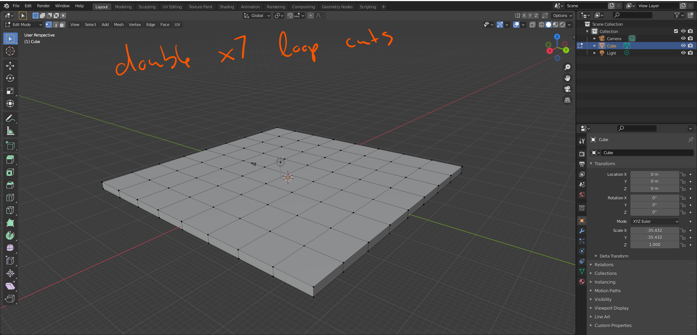

    do checker deselect

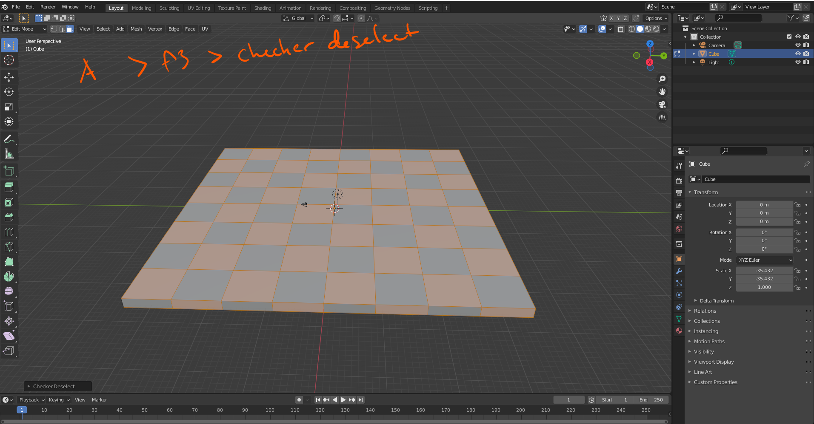

    you can change the assignment of materials here

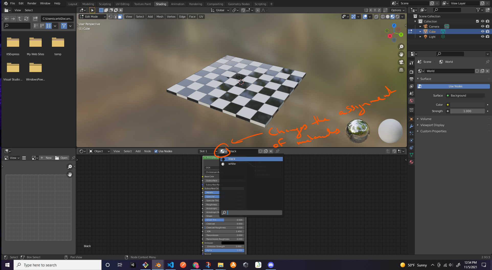

    change texture here

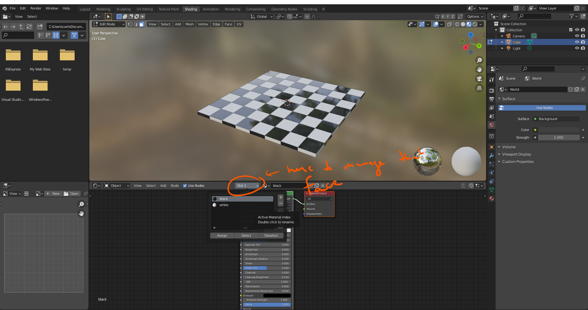

    We are now gonn add the texture coordinate

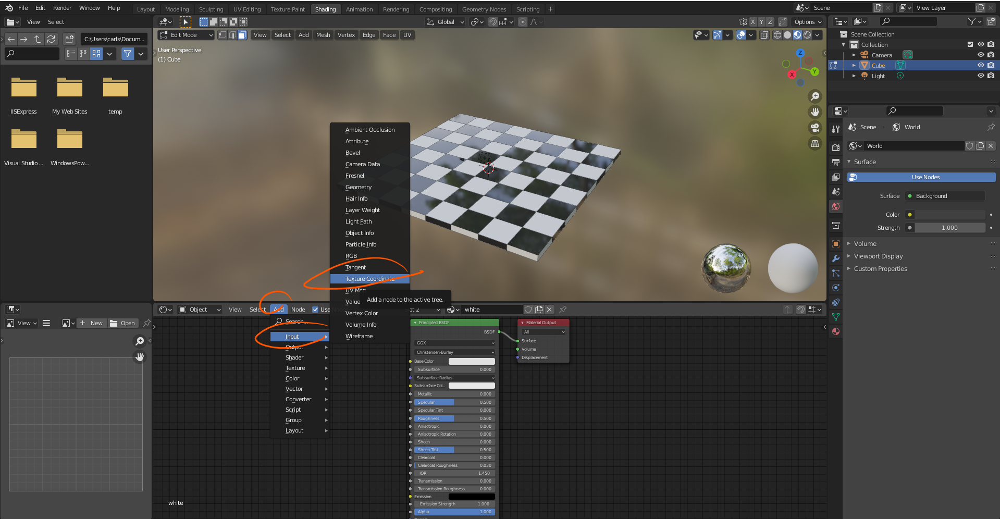

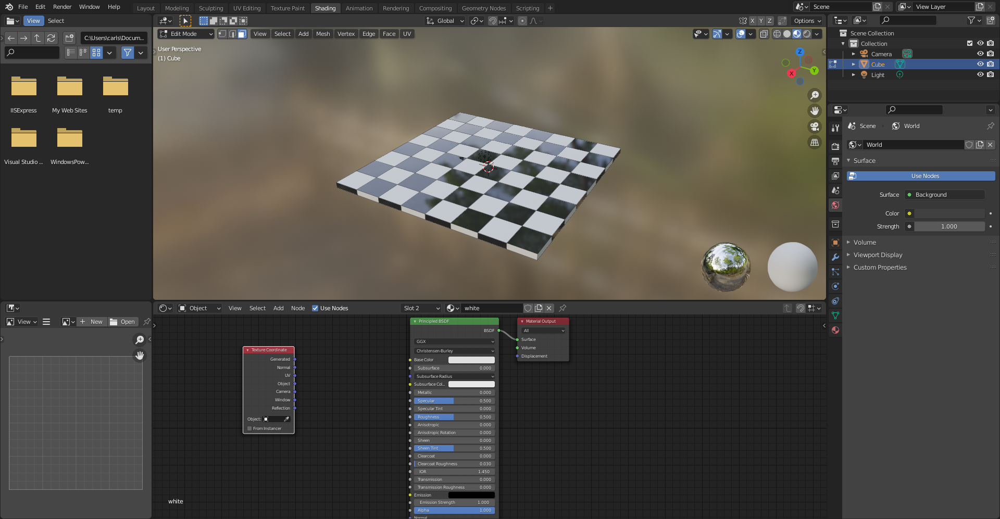

    We can add a texture, this time a wave texture

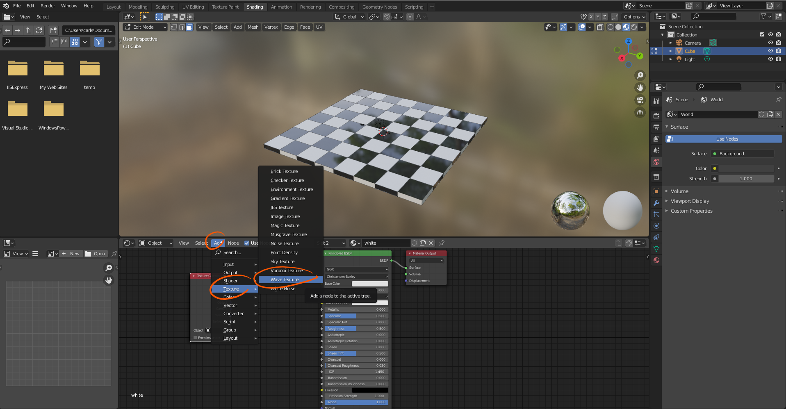

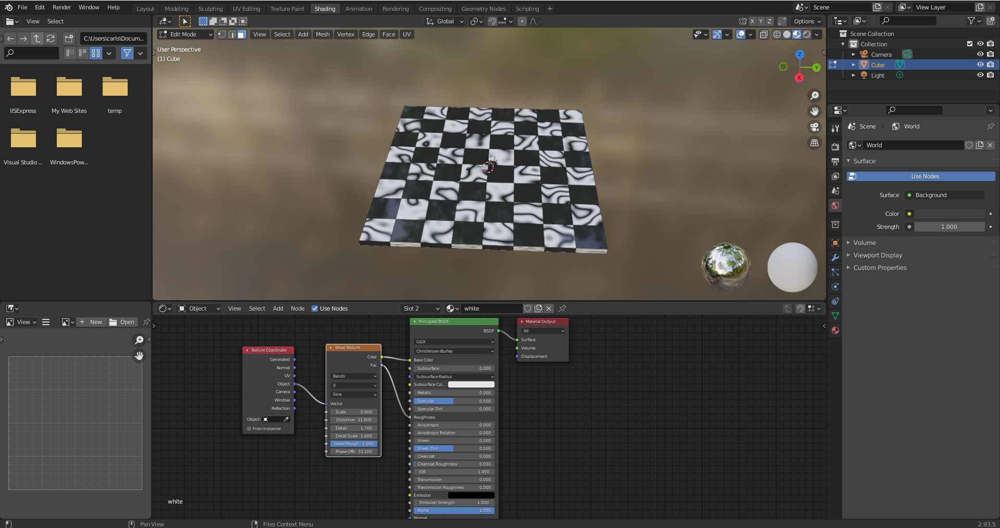

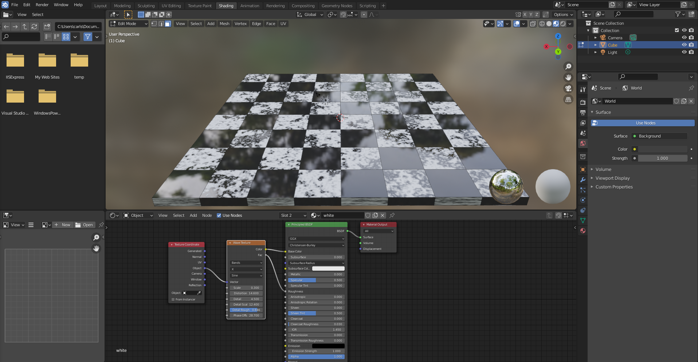

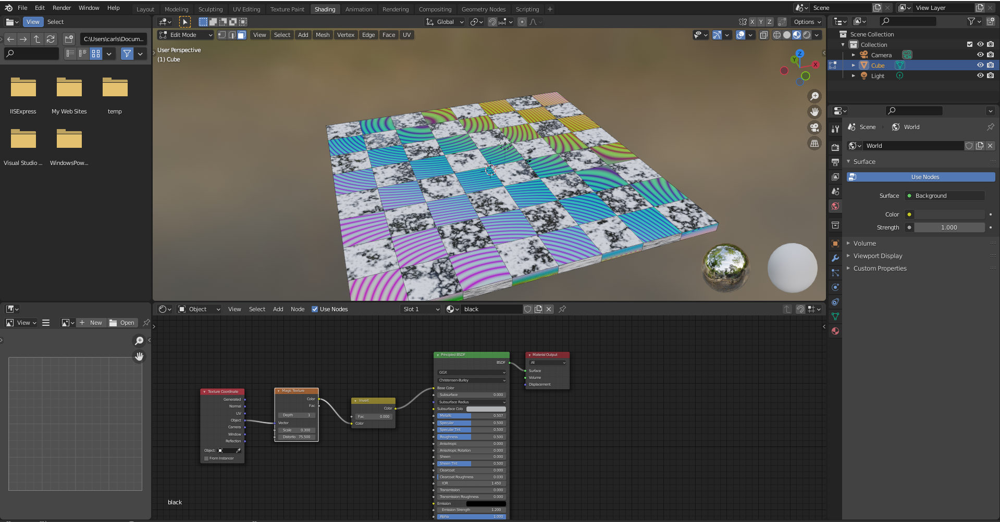

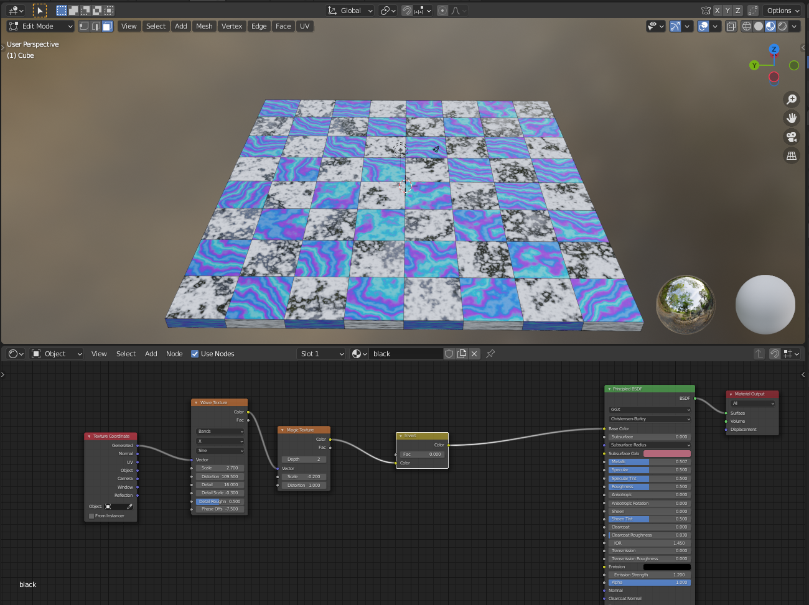

## JOIN and SEPARATE

    learned a technique to join muliple pieces together when you need to to apply something to alot at once
    CTRL + J in object mode and then when you are done with whatever, going into edit mode and separarating by first highlighting all with A
    and then separate by parts with P

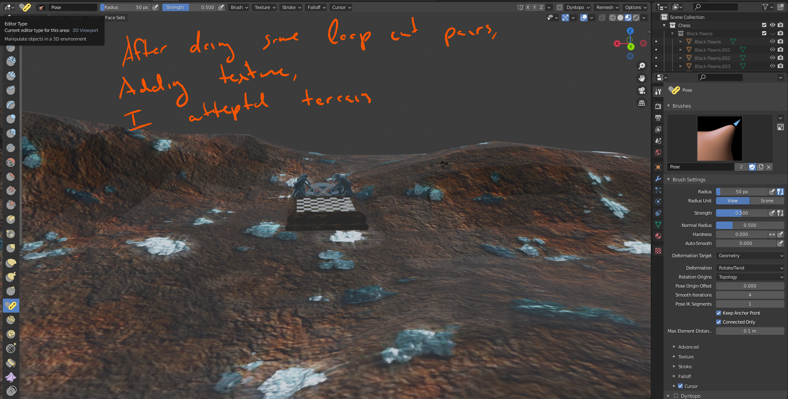

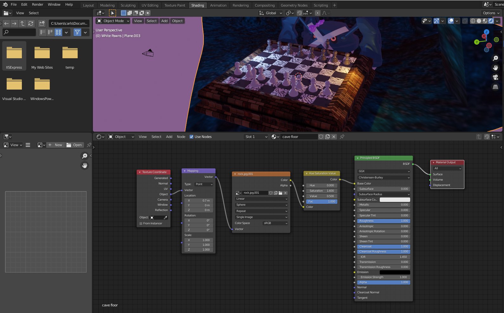