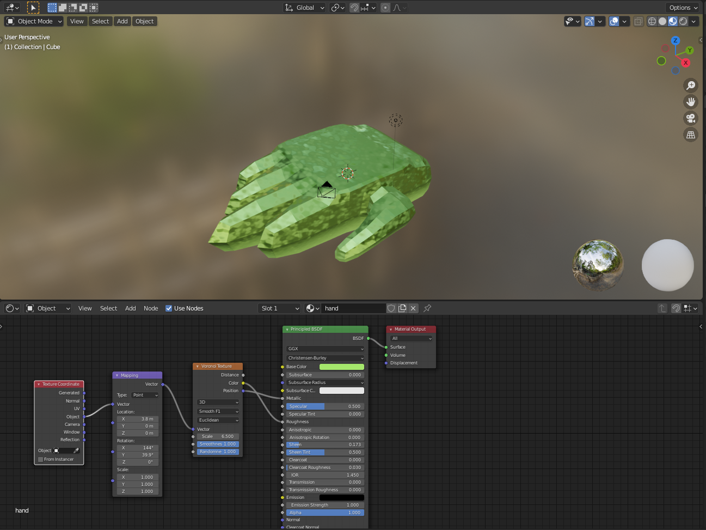

# DEV-50, Topology, -Tris, Quads, nGons
#### Tags: [Topology, Tris, Quads, nGons, hand, ]

## Stuff

    before this lecture starts, I made a hand by subdividing a cube only once and then scaling and loop cutting the shere to make a hand. and then I applied these textures:

    

    As long as ab object can make a square after it is loop cut, it can be loop cutted again. This is why Quads are great

## Non planar geometry

    https://www.udemy.com/course/blendertutorial/learn/lecture/13893148#questions