# DEV-54, Introduction to the Grease Pencil
#### Tags: [Grease Pencil, Autoframing]

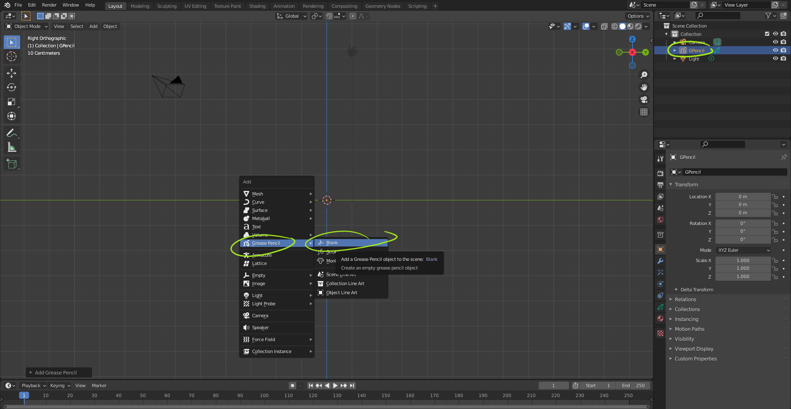

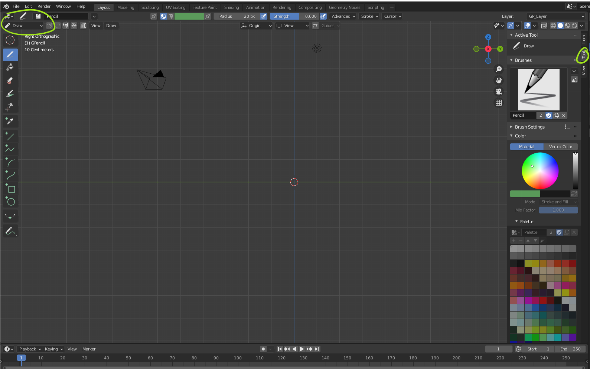

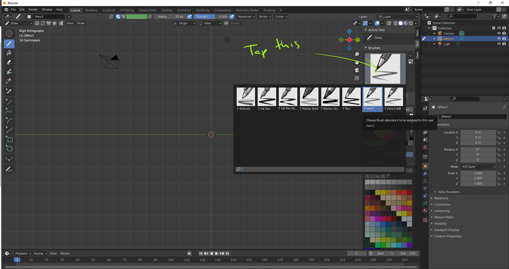

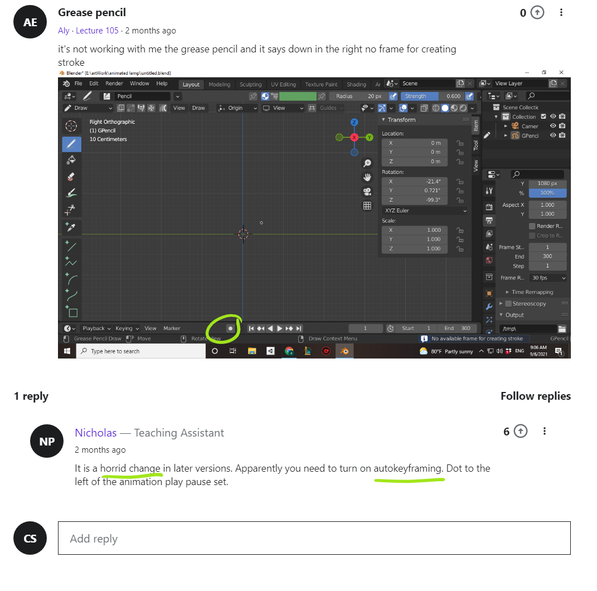

    Holding down the Alt key as you draw creates straight lines

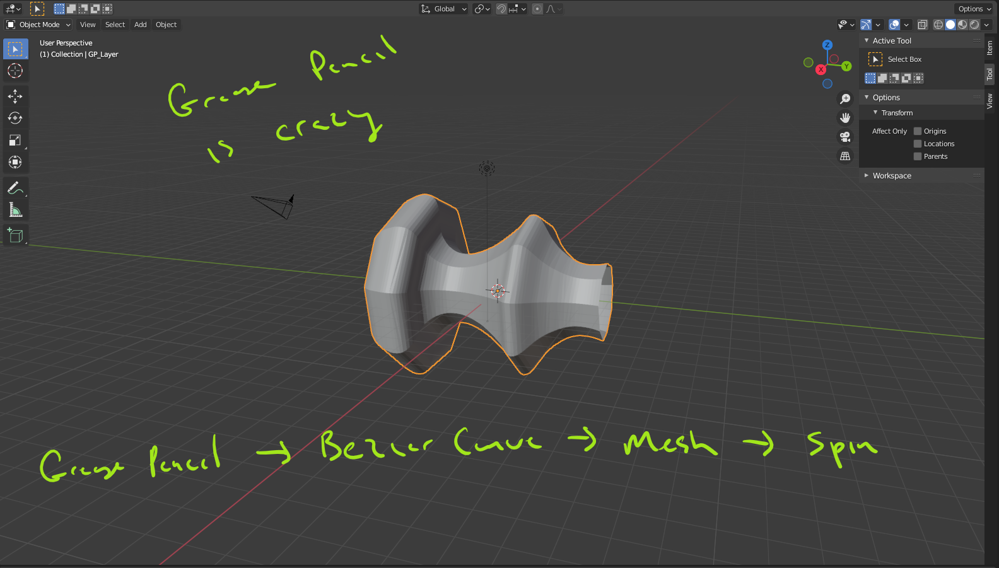

    Holding down Shift as you draw adds a bit of delay as you draw, allowing for curved lines or so

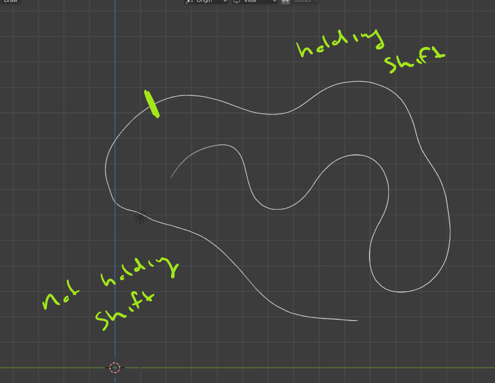

    Press space after use use these tools

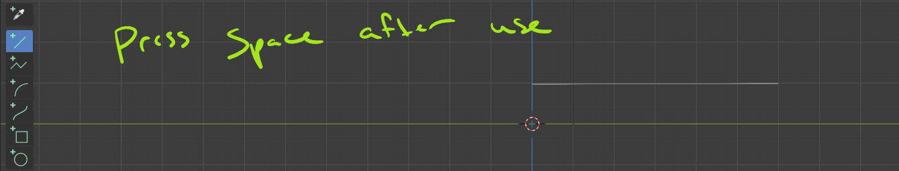

    side view

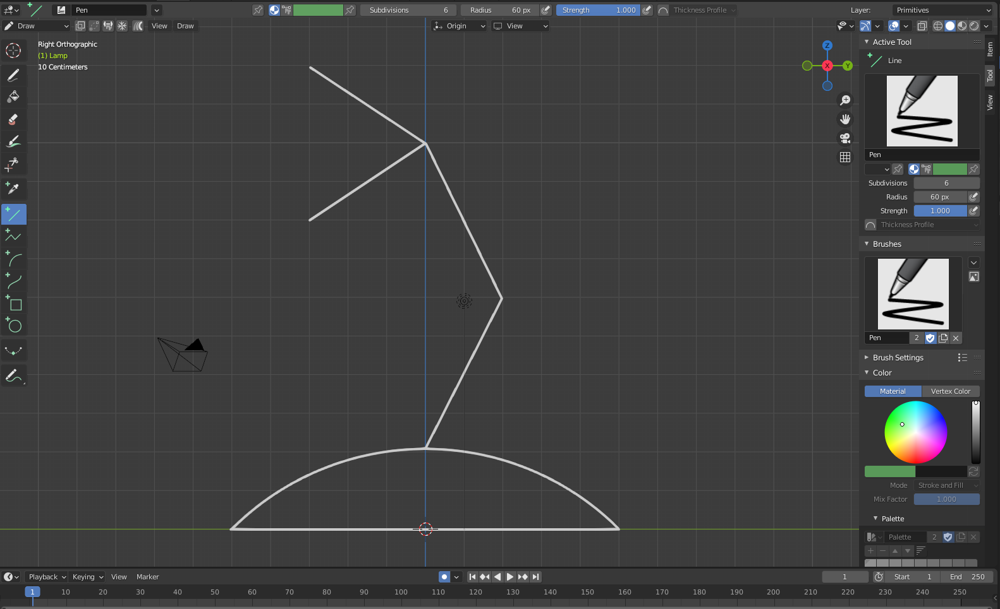

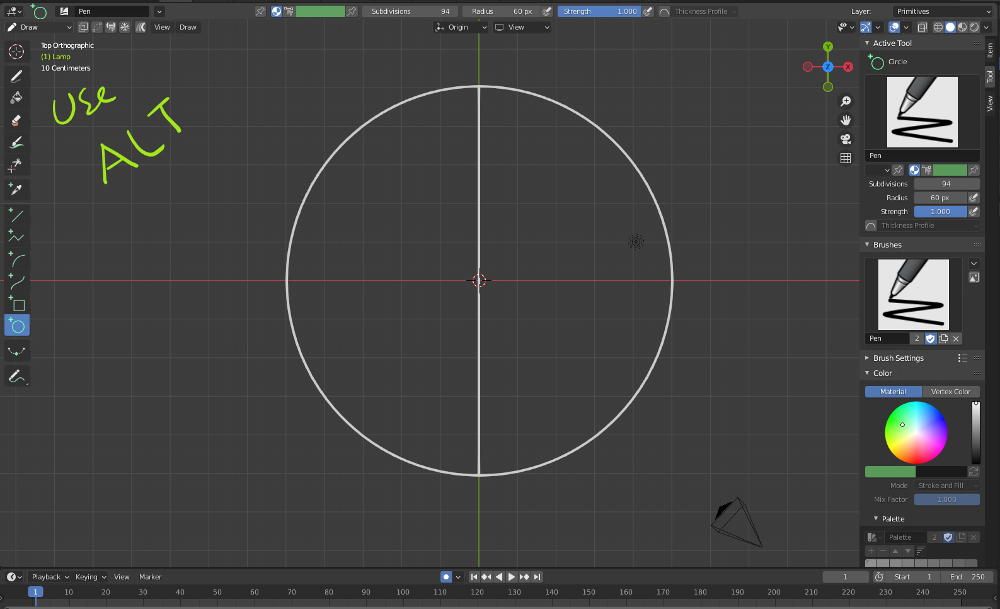

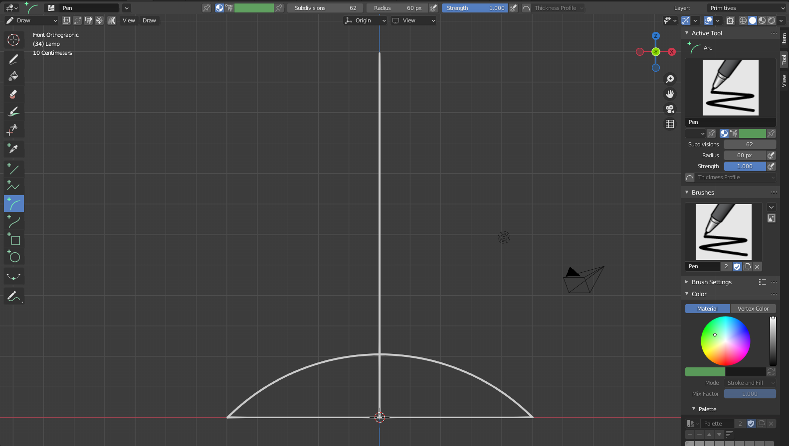

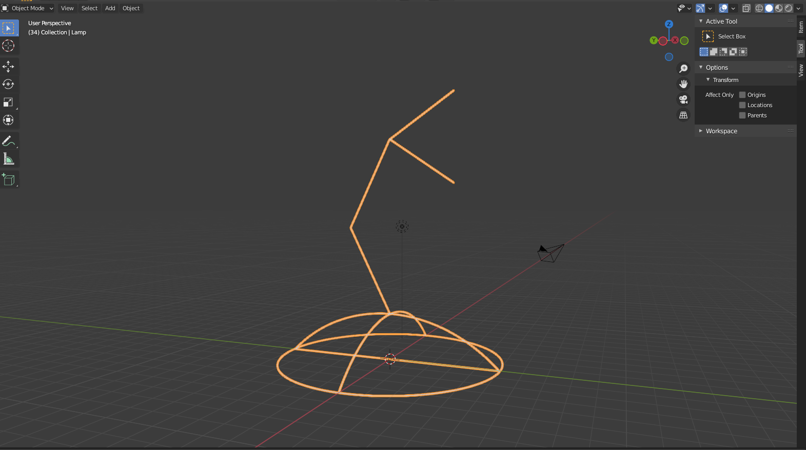

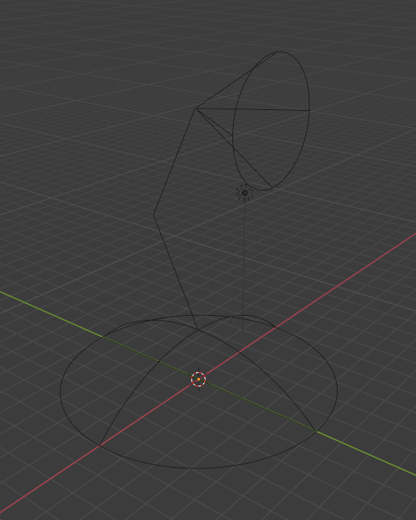