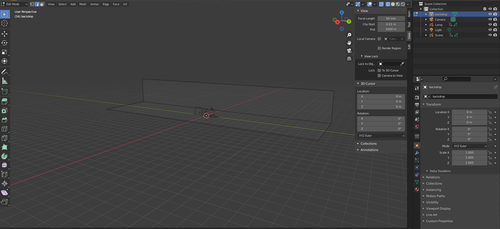
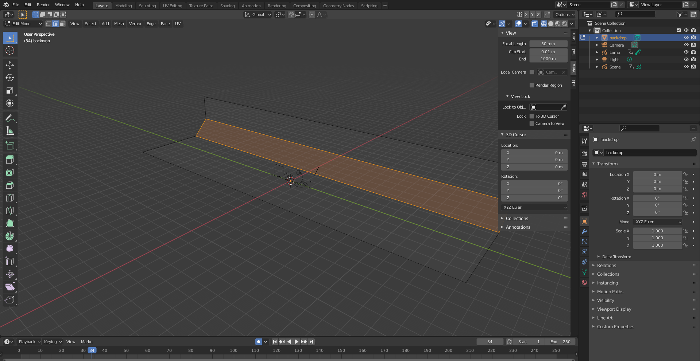
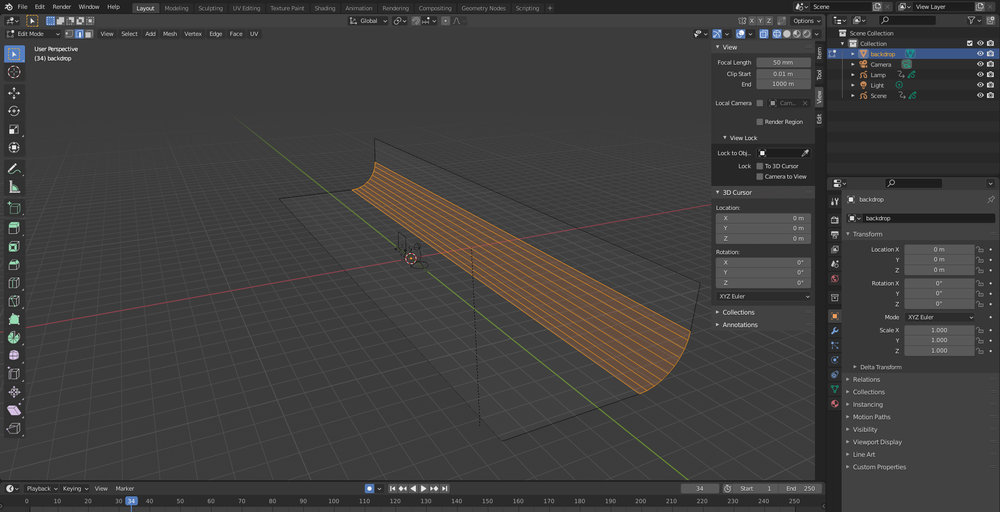
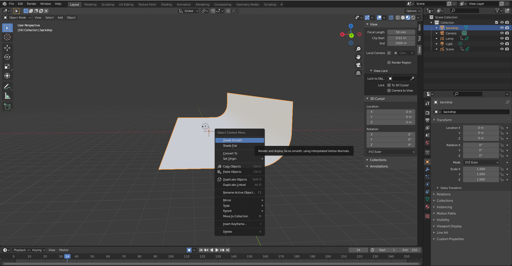
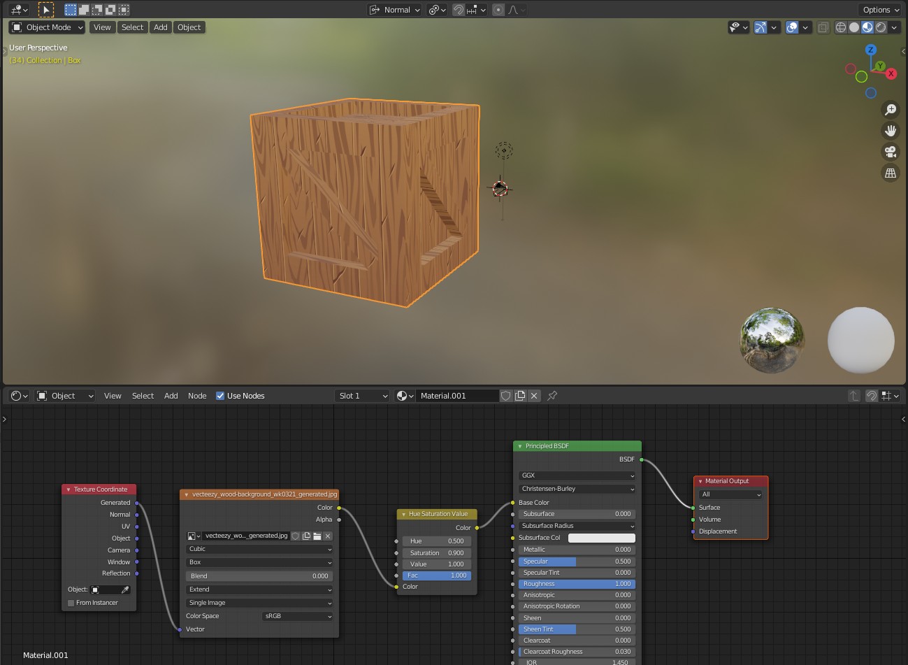
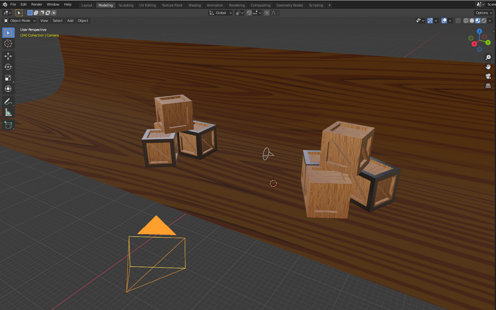

# DEV-55, Creating a Backdrop
#### Tags: [backdrop, bevel, smooth shading, inset, knife tool]

    Create a Backdrop with a series of extusions and scaling on the y axis

    To remove this harsh corner, you can do Ctrl + B

    You can also add a few more cuts with the scroll wheel

    You can also limit the distance with an obstructing loop cut

    You can add smooth shading with a simple right click

    If you ever see a harsh line, there is likely two bits of geometry comming at eachother at crazy angles. you can do merge by distance to help rememdy that

## additional stuff off lecture

    It inset multiple faces, press i twice
    https://www.youtube.com/watch?v=Ut1PhGvbCZU

## got texture off here

    https://www.vecteezy.com/vector-art/2193057-wood-texture-background

    the backdrop

