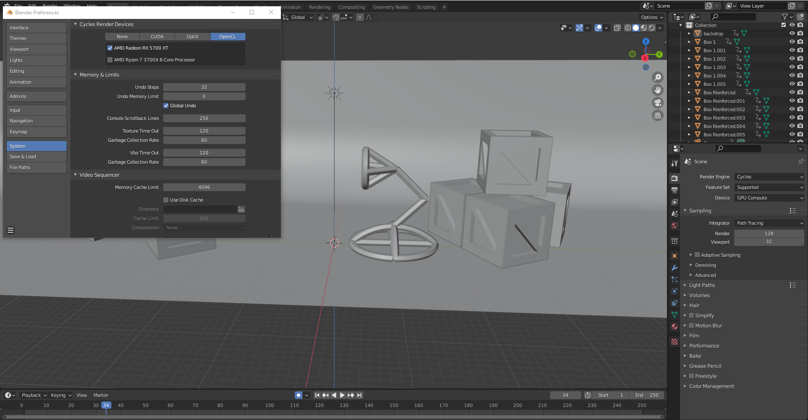
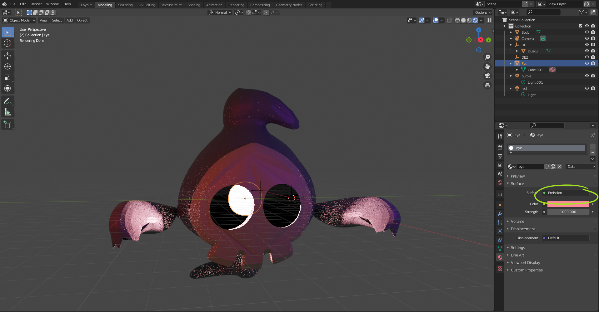

# DEV-58, Lighting Cycles Vs Eevee
#### Tags: [cycles, eevee, lighting, emissions]

## Graphics Card Stuff 

    To check you specs on PC
    run > msinfo32

    To make changes in blender
    Edit > Preferences > System

## Lighting

    In cycles, we are always rendering, and if we are always rendering there is a chance that blender may crash

    Here is how you apply an emission light source
    you can see the reflections in cycles but not in Eevee
    We will find a way to manage the grainyness soon

