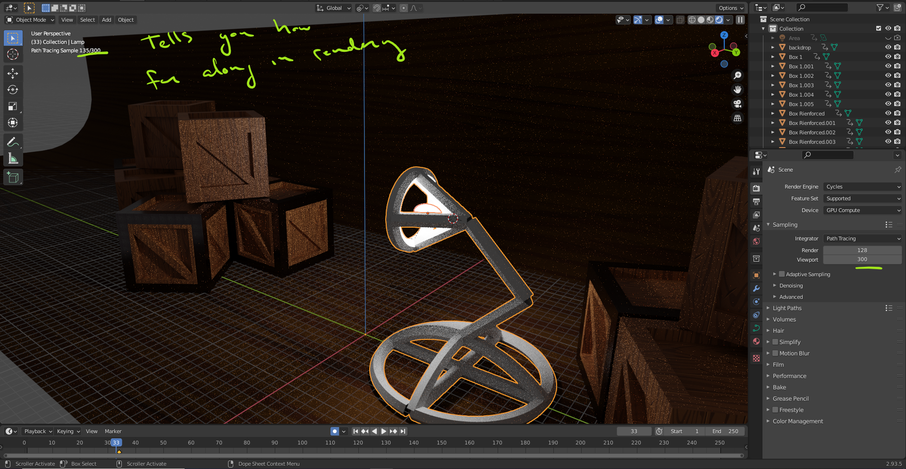
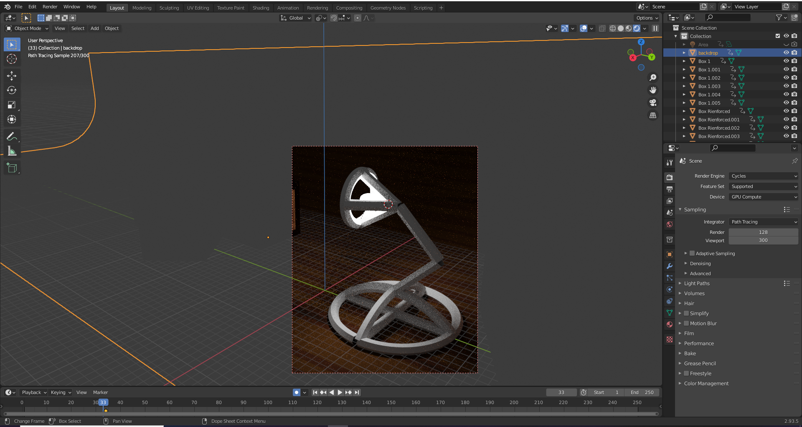
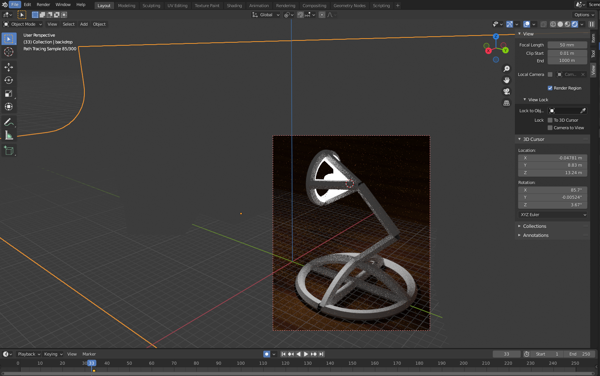

# DEV-59, Rendering a small area
#### Tags: [rendering, cycles]

    For the sake of speed, you can render a smaller area
    Using CTRL + B (then let go) then highligh what you want to render

    To turn it off, do CTRL + ALT + B

    You can toggle it here

    You can even add this to the camera

