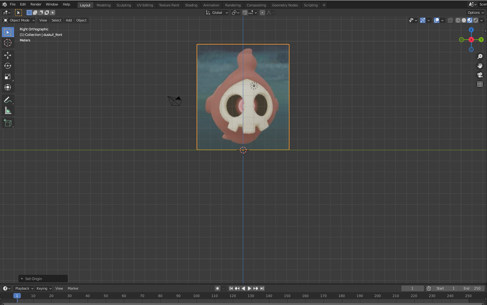
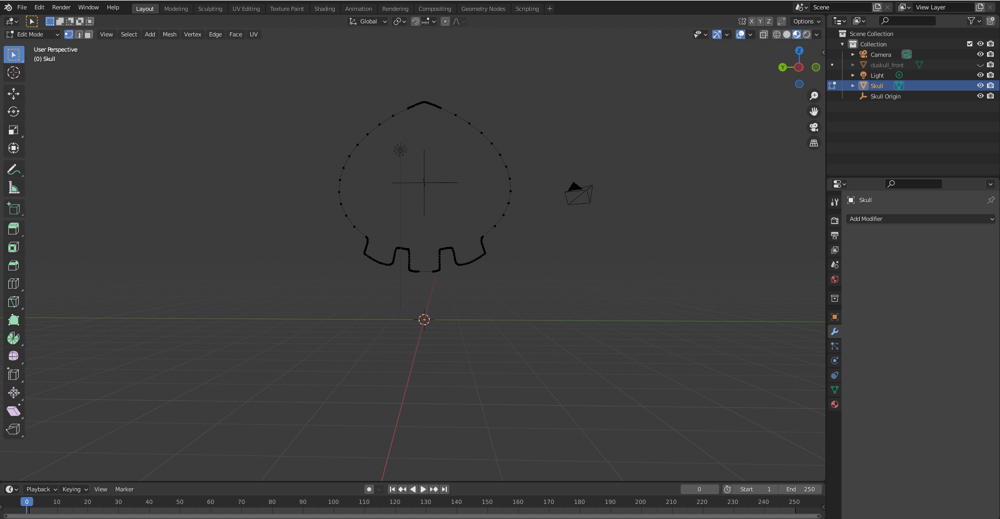
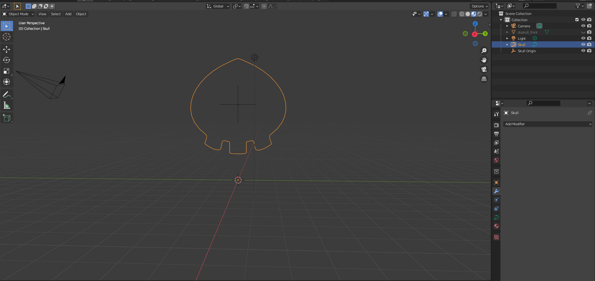
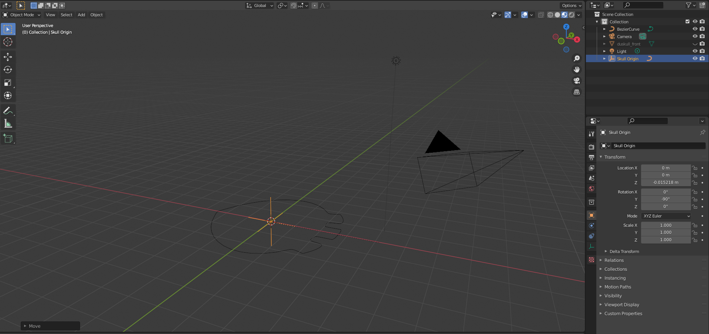
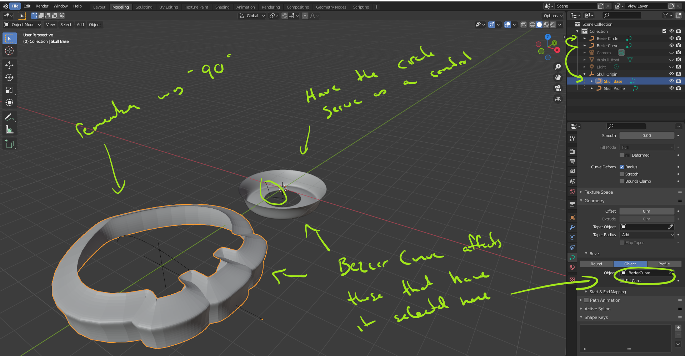
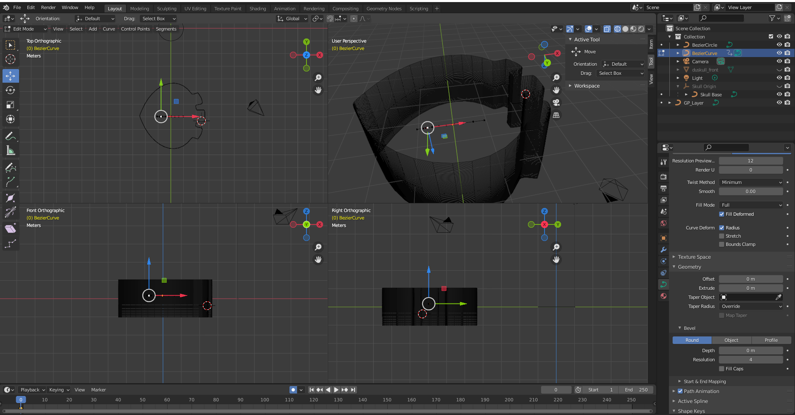
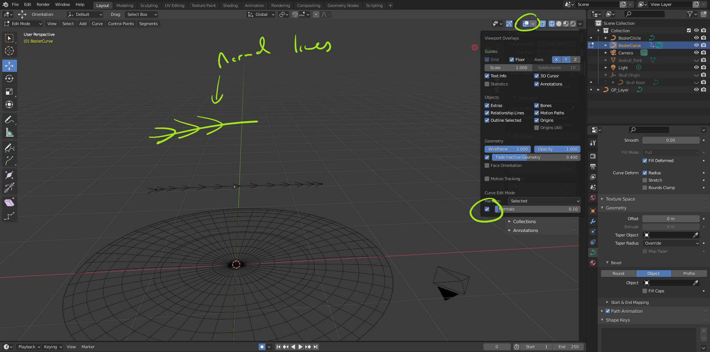
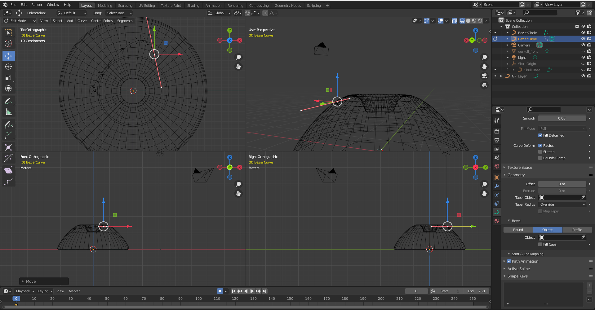
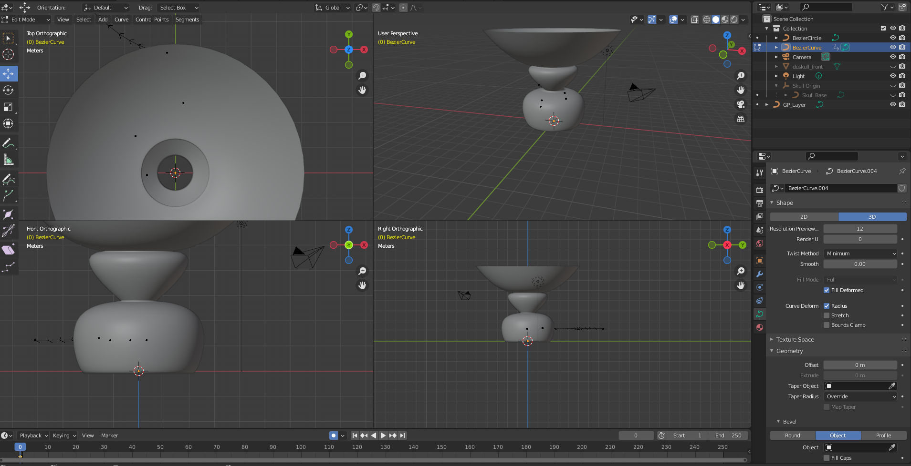
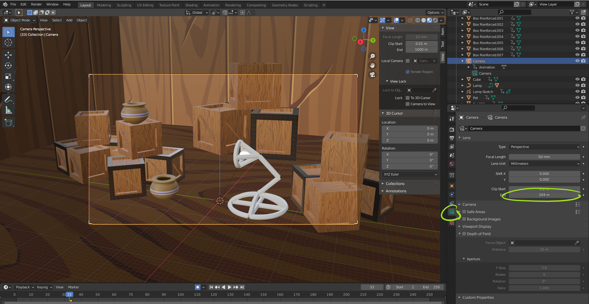

# DEV-60, Using Curves to generate Geomentry
#### Tags: [geometry, curves]

## Redo Recreation of Duskull's face

    Add reference image as plane

    Add a bezier curve, 
    turn it into a mesh,
    and mirror it

    Turn it back into a curve, 

    parent to empty, 
    rotate empty along Y by -90 degrees 
    translate to z = 0 global

    Have a circle curve and a regular curve. it will serve as your controller as they look at this curve in green

    select the Skull base
    head to curve properties down to geometry, then down to bevel
    select Object option

    Quad view with CTRL + ALT +  Q

    you can use key V and select vector
    you can also extrude here

## Import our randomly created pot

    export as an fbx
    increase render distance of our camera

