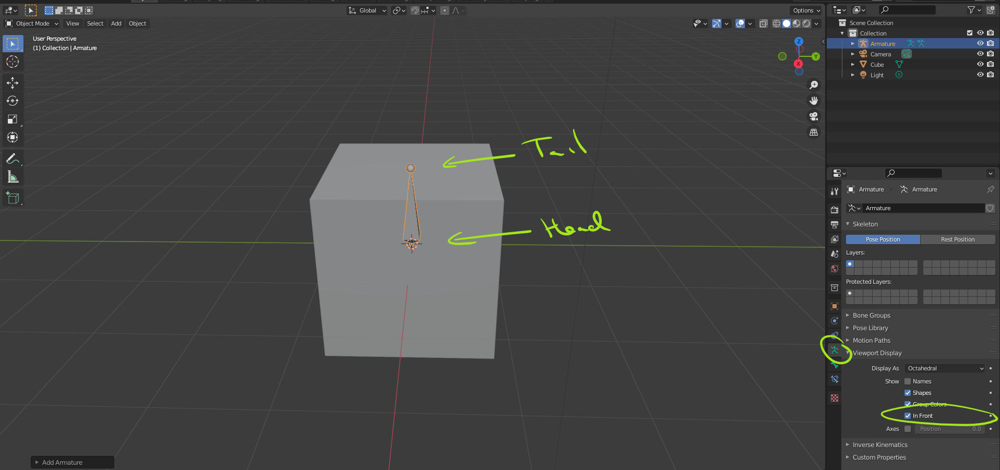
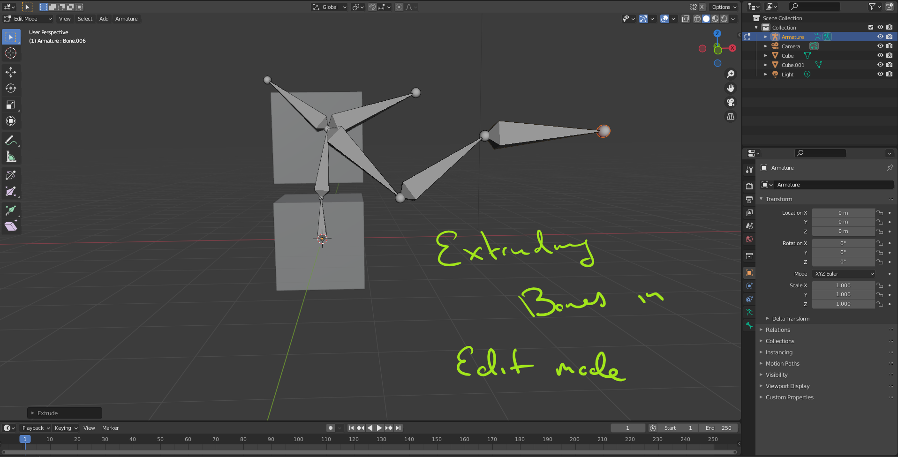
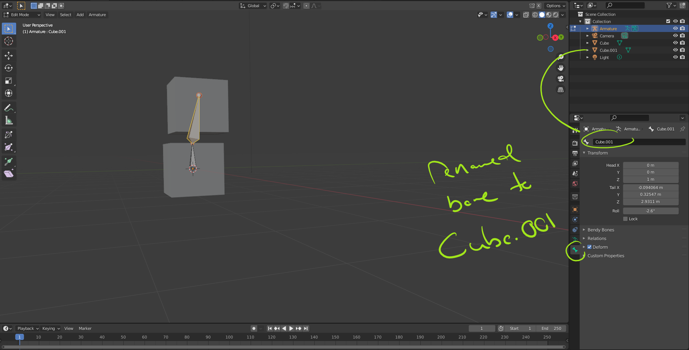

# DEV-61, Introduction to Armatures
#### Tags: [Armatures]

    You can also extrude bones using the E key

    ususally you name bones to match the same object it is controlling

    I dont get parenting with bones, perhaps at a later time