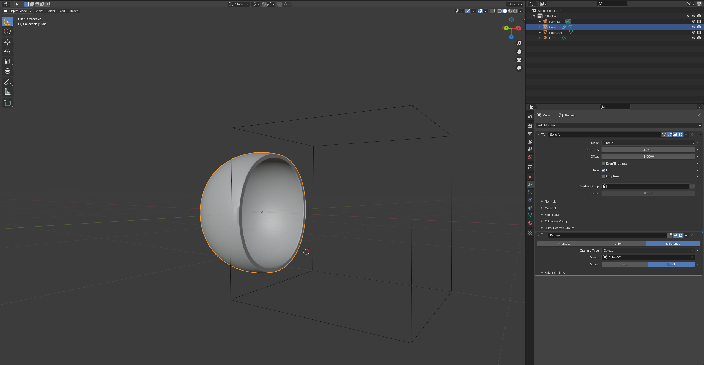
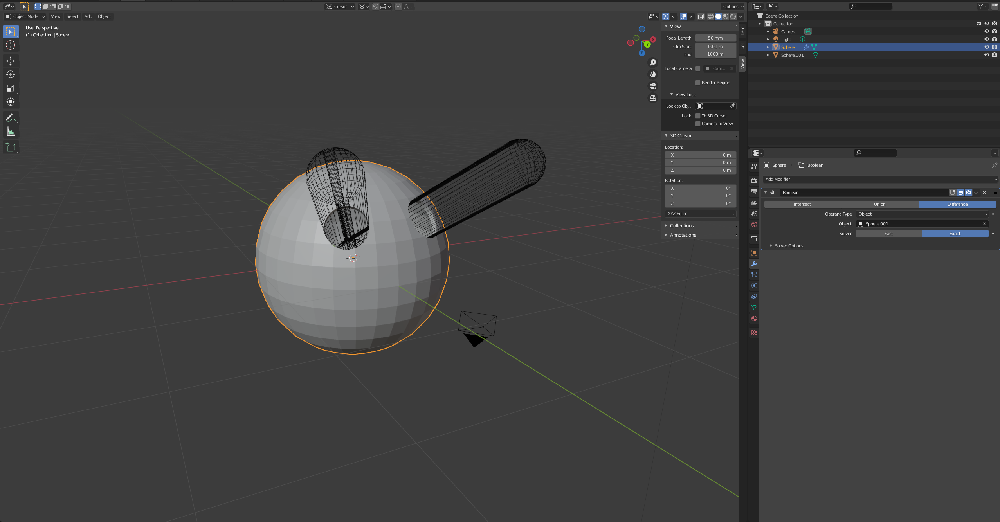
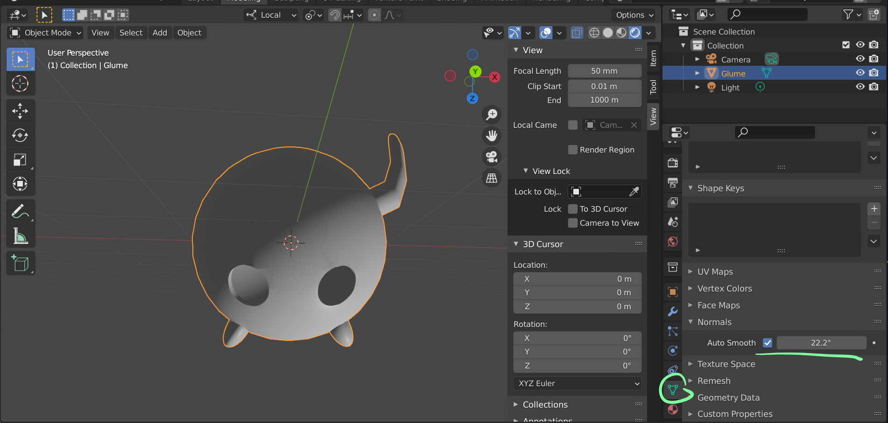

# DEV-62, Using the solidify modifier, and boolean modifier revisit
#### Tags: [solidify, boolean]

## Adding thickness to a mesh using solidify modifier

## merging objects when using boolean modifier

    Make sure the are not subdivided shapes

    Adjust normals here

