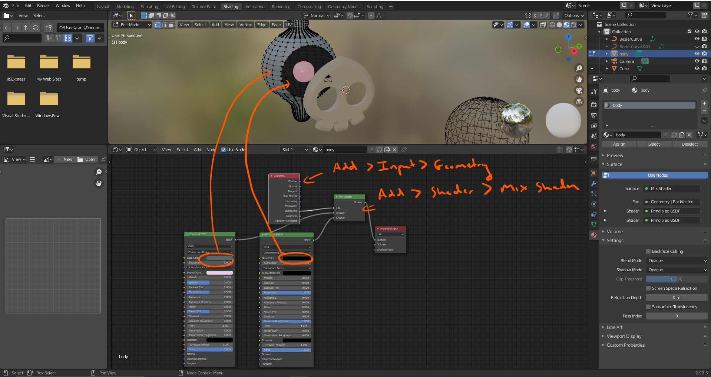
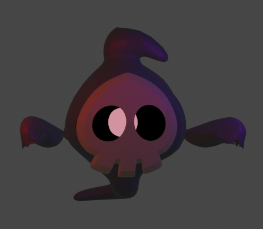

# FUN-02, Duskull
#### Tags: [Mirror Modifier, Boolean Modifier, Double sided textures]

    Making sure that mesh has different textures on both sides

    https://www.youtube.com/watch?v=ZsXz1Vy3XwI

    for the hand E : .5

    for the hand E : .5
    for the hand S : .99

    for the hand E : .5
    for the hand S : .96

    for the hand E : .5
    for the hand S : .9

    for the hand E : .5
    for the hand S : .8

    for the hand E : .5
    for the hand S : .6

    for the hand E : .5
    for the hand S : .4

