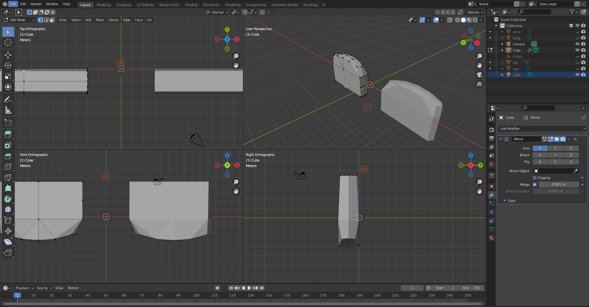

# FUN-03, Dusclops
#### Tags: [circlecurve, mirror, toSphere, extruding]

## Modeling

    Body created using the circle curve on curve method and a duplication. Mouth things were created with checkered like selection with individual origin extrusiuons.

    Hands created using subdivided cube that was molded alongside a mirror modifier then applied, Fingers created from the extrusions on the top

    Worked on detailing tthe hand a bit more with several rotations and subdivisions and mirroring

    Used toSphere to create the eye 

    then used shift + alt + s to make the pupil

    Attach the legs and arms using the boolean Modifier

## Textures
    https://imagecolorpicker.com/

